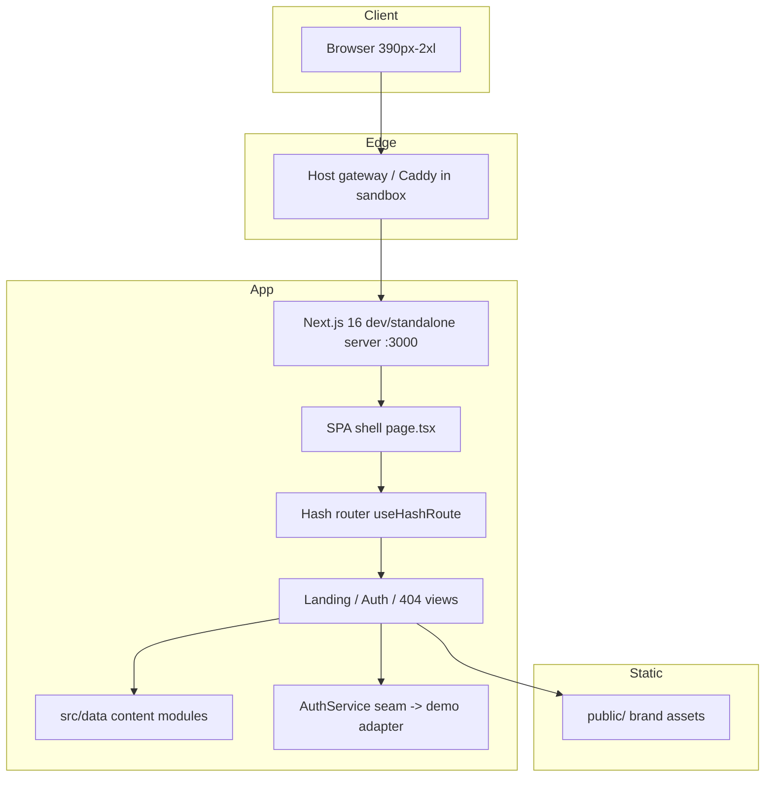

# Event Spark 2 — Master Project Architecture Document (PAD) v1.1.2

**Classification:** Internal Engineering Reference
**Status:** DEFINITIVE, PRODUCTION-LOCKED BLUEPRINT
**Companion Documents:** [README.md](./README.md) (product overview) · [AGENTS.md](./AGENTS.md) (agent shortcuts) · [CLAUDE.md](./CLAUDE.md) (agent workflow) · [docs/REMEDIATION_PLAN.md](./docs/REMEDIATION_PLAN.md) (round-1 audit + fixes) · [docs/SECURITY_AUDIT.md](./docs/SECURITY_AUDIT.md) (layered code review + security audit) · [docs/how-to-git-push-using-ssh-wrapper_SKILL.md](./docs/how-to-git-push-using-ssh-wrapper_SKILL.md) (SSH push procedure)
**Last Updated:** 2026-09-14
**Audience:** Senior Engineers, Tech Leads, DevOps, and Onboarding Engineers
**Rule:** Every architectural decision in this document traces to a specific rationale. Nothing is here "because it's popular."

---

#### Revision Block — v1.1.2 (Session-3 Re-Verification & Delivery Tooling)

- `[SR]` Full gate chain re-verified on the refreshed dependency tree (lockfile re-sync): lint 0 problems · `tsc --noEmit` 0 errors · Vitest 21/21 · production build succeeds (`/` + `/_not-found` static, `/api` dynamic) · dev server and preview healthy.
- `[SR]` `bun.lock` re-synced so the root package section matches the committed `package.json` ranges (the v1.1.1 commit carried a stale root block). Security-critical resolutions unchanged and re-verified in the lockfile: `next@16.3.5`, `sharp@0.35.4`, `postcss@8.5.28` (overrides enforced).
- `[SR]` Live E2E suite re-run against the deployed preview: **38/38 PASS, twice consecutively** (deterministic). Three transient failures observed mid-session were root-caused to a toolchain regression in the *test harness*, not the app: `agent-browser find … click/fill` commands stopped dispatching effective events. The workspace E2E script now drives all form fills (native setter + input event) and clicks (JS `.click()`) through selectors; `T18.1` tightened from substring to exact URL match (it previously false-passed on `/unknown-path-x`). No application-code changes were required.
- `[SR]` Computed-style parity re-run vs `event-spark-2.lovable.app`: all audited invariants hold (H1 68px/700, hero CTA 56px/36px-pad, nav 72px, 7 `#/` anchors, tokens identical); remaining diffs are the documented known-equivalent serializations.
- `[SR]` Supply-chain re-audit: `npm audit` against the current dependency set reports **0 critical / 0 high / 0 total** at fresh resolution; the previously registered 8 dev/lint-time-only advisories are cleared at current range resolution (older dev-chain pins that remain in the exact lockfile stay accepted as documented residual — not shipped in the standalone artifact).
- `[SR]` Delivery tooling vendored into the repo: `docs/ssh_git_wrapper_v3.py` (paramiko-based Git SSH transport, with the `shlex` command-quoting fix) + `docs/how-to-git-push-using-ssh-wrapper_SKILL.md` (procedure, flags, troubleshooting, repo push rules). The wrapper is the canonical push path for restricted hosts and was verified via `ls-remote`/`fetch`/`pull` in this session.

#### Revision Block — v1.1.1 (Security-Audit Release)

- `[SR]` Layered code review + security audit executed (methodology: foundation skills `code-review-and-audit`, `security-and-hardening`, `code-review-checklist`, `verification-and-review-protocol`); full report with evidence in `docs/SECURITY_AUDIT.md`.
- `[SR]` Contract conformance verified: every behavioral claim in AGENTS/CLAUDE/README/PAD checked against code — PASS. Zero application-logic defects found.
- `[SR]` Supply-chain remediation: `next` 16.1.3 → **16.3.5** (clears 34 advisories incl. two unauthenticated-RCE criticals, GHSA-p293-qw3h-jr36 / GHSA-2xp9-vwfh-vxw4); `sharp` overridden to 0.35.4 and `postcss` to 8.5.28 via `package.json` `overrides` (clears the high advisories). Residual: 8 dev/lint-time-only advisories, documented in the audit's residual-risk register.
- `[SR]` Baseline security headers added at the app level (`X-Content-Type-Options`, `X-Frame-Options: DENY`, `Referrer-Policy`, `Permissions-Policy`); CSP intentionally deferred to the edge (inline-style constraint documented).
- `[SR]` §7.3c ledger records the Round 2 closing gates (all green on Next 16.3.5).

#### Revision Block — v1.1.0 (Remediation Release)

- `[SR]` Post-deployment E2E + visual-parity audit executed (findings F-01…F-14 in `docs/REMEDIATION_PLAN.md`); P1/P2 findings remediated and re-verified (§7.3b).
- `[SR]` User-facing CTAs converted to real hash anchors (ADR-007); auth failures now carried by a typed `AuthServiceError` (ADR-008); Vitest wired with two unit suites (21 tests).
- `[SR]` Scaffold surface pruned: 46 unused shadcn/ui components and ~37 unused dependencies removed (14 runtime deps remain); `allowedDevOrigins` added for the sandbox preview host.
- `[SR]` §3.3 Pattern 1 code snippet corrected to match the shipped `parseHash` (exact `/auth` match; auth subpaths intentionally 404 — reference parity).

#### Revision Block — v1.0.0 (Initial Release)

- `[SR]` Initial PAD generated from the shipped v1.0.0 codebase (commit `0fa109b`), grounded in the measured-clone build methodology.
- `[SR]` Design-token values in §5 are transcriptions of computed styles read from the live reference site, not designer guesses.
- `[SR]` Verification ledger (§7.3) records the exact gates executed before this document was written.

---

## Table of Contents

1. [System Overview & Decisions](#1-system-overview--decisions)
2. [High-Level System Topology](#2-high-level-system-topology)
3. [Application Architecture](#3-application-architecture)
4. [Data Architecture](#4-data-architecture)
5. [Design System Reference](#5-design-system-reference)
6. [Security Architecture](#6-security-architecture)
7. [Testing Strategy](#7-testing-strategy)
8. [Build & Deployment](#8-build--deployment)
9. [Developer Handbook](#9-developer-handbook)
10. [Known Issues & Outstanding Tasks](#10-known-issues--outstanding-tasks)
11. [Key Files Reference](#11-key-files-reference)
12. [Glossary](#12-glossary)

---

## 1. System Overview & Decisions

### 1.1 Document Metadata & Purpose

This PAD is the single source of truth for the Event Spark 2 engineering reference: how the system is wired, why each consequential choice was made, and how to extend it without breaking the invariants. Use it three ways: **onboarding** (read §1–§5, then §9), **debugging** (§3.3 patterns, §9.3 gotchas, §10 known issues), and **reviewing technical choices** (§1.3 ADRs). It deliberately excludes product copy (see `src/data/`) and agent workflow detail (see CLAUDE.md).

### 1.2 Technology Stack Summary

| Layer | Technology | Version | Key Rationale |
| --- | --- | --- | --- |
| Web framework | Next.js (App Router) | 16.3.5 | Matches the foundation's stack and the sandbox contract; standalone output for container deploys; version pinned above the 16.3.3 security floor (see §6.4) |
| UI runtime | React | 19 | Required by Next 16; concurrent features power the animation layer |
| Language | TypeScript (strict) | 5 | Compile-time contract enforcement across the typed content and service layers |
| Styling | Tailwind CSS | 4 (via `@tailwindcss/postcss`) | CSS-first `@theme` tokens match the foundation's convention and keep the design system in one file |
| UI primitives | shadcn/ui on Radix | 3 components in use | Accessible tabs/toaster without hand-rolled ARIA; scaffold pruned to what ships |
| Animation | framer-motion | 12.23.2 | Declarative scroll reveals and presence-based word rotation |
| Smooth scroll | lenis | 1.3.26 | The reference site's actual scroll engine; `autoRaf` mode |
| Forms | react-hook-form + @hookform/resolvers + zod | 7.60 / 5.1 / 4.0 | Typed schema validation with per-field error surfacing |
| Unit testing | Vitest | 5.0 | `parseHash` + demo auth adapter contract suites (21 tests) |
| Icons | lucide-react | 0.525 | Same icon family as the reference (stars, arrows, puzzle) |
| Notifications | shadcn toaster (Radix toast) | scaffold | Toast contract used by the auth flows |
| Runtime / PM | Bun | ≥ 1.1 | Fast installs, native dev-server runner for this workspace |

No database, no HTTP API layer, no background workers in v1.1.0 — §4 and §7 of the canonical PAD structure are intentionally reduced to their applicable cores.

### 1.3 Architecture Decision Records

**ADR-001: Rebuild on Next.js 16 App Router (single route) rather than porting the reference's Vite SPA**

- **Context:** The reference is a Lovable-generated Vite + React SPA. The task demands a production-grade clone, and the deployment/hosting sandbox exposes exactly one HTTP route (`/`) backed by a Next.js dev server.
- **Decision:** Rebuild as a Next.js 16 App Router application with exactly one page route (`src/app/page.tsx`) acting as an SPA shell; all views switch client-side via a hash router.
- **Rationale:** Preserves the sandbox's single-route contract, keeps deep links and browser history working through the hash, and aligns with the foundation repo's stack (Next 16 + React 19 + TS strict), which the task designated as the convention source.
- **Consequences:** + Server-rendered shell, one deployment artifact, foundation-compatible. − URL paths cannot express views (`#/auth` instead of `/auth`); converting to path routing later requires adding routes and updating `onNavigate` call sites.
- **Alternatives Rejected:** Multi-route App Router pages (violates hosting constraint); porting the Vite SPA verbatim (loses the foundation's conventions and the sandbox contract).

**ADR-002: Hash-based view routing with a typed `AppRoute` union**

- **Context:** The shell must switch between landing, auth (login/signup), and 404 without path routes, while preserving back/forward and shareable URLs.
- **Decision:** `useHashRoute` (src/hooks/use-hash-route.ts) parses `window.location.hash` into a discriminated union (`{view:'home'} | {view:'auth', mode} | {view:'not-found'}`); navigation flows exclusively through an `onNavigate(to)` callback passed to views.
- **Rationale:** A single parser is the only place routing logic exists; the union makes impossible states unrepresentable; the callback contract decouples sections from the router.
- **Consequences:** + One-file routing, exhaustively typed. − Query-in-hash (`#/auth?mode=signup`) is a convention to respect in `parseHash`.
- **Alternatives Rejected:** URL-state libraries (overkill for three views); context-based view state (loses history).

**ADR-003: Design tokens extracted from the live reference via computed styles**

- **Context:** The brief demands a faithful clone. Screenshots drift; memories drift more.
- **Decision:** All colors, fonts, radii, paddings, heights, and section rhythms were read off the rendered reference DOM (`getComputedStyle`, `getBoundingClientRect`, outerHTML) during the build, then encoded in `globals.css` (`@theme inline` + `:root` HSL vars) and Tailwind arbitrary-value classes.
- **Rationale:** Computed styles are the ground truth of what the browser actually paints; the resulting tokens matched the reference to the pixel in verification (e.g. hero 844px tall, H1 at y≈283, event card image wrap radius 24px, CTA padding `0 36px`).
- **Consequences:** + Verifiable parity; maintenance means re-measuring, not guessing. − Token names mirror the reference's shadcn HSL scheme, so brand renames touch `:root` only.
- **Alternatives Rejected:** Eyeballing screenshots (fidelity risk); copying the reference's built CSS wholesale (unmaintainable, license-opaque).

**ADR-004: Authentication behind an `AuthService` interface with a deterministic demo adapter**

- **Context:** The reference authenticates against Supabase; this rebuild has no backend contract, yet the auth UI must be complete and honestly verifiable.
- **Decision:** `src/lib/auth/types.ts` defines the service boundary (`signIn`, `signUp`, `signInWithProvider`, `requestPasswordReset`); `demo-auth-service.ts` implements it with ~900ms simulated latency and deterministic rules (signup rejects passwords < 8 chars or without case/digit variety; reset always succeeds without leaking account existence). `index.ts` is the single composition root.
- **Rationale:** The UI's loading/error/success states become fully exercisable without a backend, and a real adapter is a one-line binding change — no UI edits.
- **Consequences:** + Testable seam, honest demo mode. − Sign-in accepts any well-formed credentials by design (documented to the user in the success toast).
- **Alternatives Rejected:** Wiring Supabase now (no credentials, would ship dead config); stubbing handlers inline (untestable, unauditable).

**ADR-005: Lenis for inertial scrolling, feature-gated on reduced-motion**

- **Context:** The reference's buttery scroll is Lenis (its `html.lenis` class leaks on boot); accessibility forbids forced motion.
- **Decision:** `SmoothScroll` mounts Lenis (`autoRaf`, `lerp 0.1`) unless `prefers-reduced-motion: reduce` matches; programmatic view switches use `window.scrollTo` with `behavior: 'instant'` to bypass Lenis animation.
- **Rationale:** Matching the reference's feel while honoring WCAG motion safety; `autoRaf` avoids manual raf-loop lifecycle bugs.
- **Consequences:** + Reference-grade feel. − Native `scrollTo` during captures/tests doesn't trigger Lenis's wheel events (affects synthetic tooling, not real users).
- **Alternatives Rejected:** CSS `scroll-behavior: smooth` (different physics); no smooth scroll (deviation from reference).

**ADR-006: Self-hosted static assets; plain `` elements**

- **Context:** The reference's hero photos, avatars, and integration marks were remote/hashed URLs; hotlinking is fragile and Lovable's hashed filenames are not meaningful.
- **Decision:** All 24 marketing assets are vendored into `public/` under semantic paths (`/events/…`, `/avatars/…`, `/attendees/…`, `/integrations/…`, `/logo-glyph.png`) and rendered as plain `` tags.
- **Rationale:** Fixed-crop marketing imagery gains nothing from `next/image` optimization here, and the reference renders them identically; local files keep the repo self-contained and deployable offline.
- **Consequences:** + No remote dependency. − LCP optimization for photos is a conscious non-goal (page is marketing-light).
- **Alternatives Rejected:** `next/image` with remote loaders (config churn, no visual gain); hotlinking the reference CDN (fragile).

**ADR-007: User-facing CTAs are real hash anchors, not `onClick` buttons**

- **Context:** The v1.0.0 build rendered all six product CTAs as `<button onClick={navigate}>`. The reference site uses real `<a href>` links; an audit of the deployed clone (finding F-06) showed the landing page carried 0–1 `<a>` elements vs the reference's 6+ product links — breaking middle-click, copy-link, and crawler discovery, and violating the documented a11y floor.
- **Decision:** Every user-facing CTA is an `<a href="#/…">` anchor (navbar Log in / Sign up, hero Get started, Browse all events, final CTA, 404 Return to Home). The hash router already syncs on `hashchange`, so anchors integrate with zero extra wiring. Programmatic navigation (the post-auth redirect) keeps using the `onNavigate` callback.
- **Rationale:** Anchors restore native link semantics (crawlable, keyboard-focusable, middle-clickable) at zero behavioral cost; the 404 home link targets the real path `/` so it works from both the hash-router 404 and the server-rendered 404.
- **Consequences:** + Reference link parity, better SEO/a11y. − Browser automation must select `a[href^="#/"]` instead of `role=button` (documented in AGENTS.md Gotchas); the E2E suite was updated accordingly.
- **Alternatives Rejected:** Keeping buttons + adding `role="link"` (cosmetic, still not a link); path-based routes (violates single-route contract).

**ADR-008: Typed auth failure carrier (`AuthServiceError`) + Vitest wiring**

- **Context:** v1.0.0 defined an `AuthError` union in `types.ts` but never used it — `demoAuthService.signUp` threw a bare `Error("weak-password")` and `auth-view.tsx` string-matched `error.message` (finding F-09). No unit runner existed despite the PAD's open task (finding F-08).
- **Decision:** (a) Adapters throw `AuthServiceError extends Error` carrying `code: AuthError`; UI branches on `error instanceof AuthServiceError && error.code`, mapping codes to their documented copy. (b) Vitest 5 wired with node environment and the `@` alias; two suites cover `parseHash` (11 tests) and the demo adapter (10 tests, including the typed failure path and ~900ms latency bound).
- **Rationale:** The stringly-typed contract was exactly the bug class the types file existed to prevent; unit tests make the routing and auth seams regression-safe before any future refactor (TDD baseline for the audit round).
- **Consequences:** + Exhaustive, compiler-checked error handling; fast deterministic gates. − Test suite adds ~9s of wall time to the gate chain (simulated latency assertions).
- **Alternatives Rejected:** String-enum constants without a class (no `instanceof` narrowing); Playwright in-repo (sandbox-hostile, heavier than the seam needs).

---

## 2. High-Level System Topology



- **Client layer:** standard browsers; the product is light-mode-only and responsive from 390px up.
- **Edge layer:** in the build sandbox a Caddy gateway fronts port 3000; in production any static-friendly Node host works (standalone output, §8).
- **Application layer:** a single Next.js server rendering the shell; everything after first paint is client-side.
- **Data layer:** none — typed in-repo content modules.
- **External services:** none at v1.0.0; the auth seam is the designated attachment point.

---

## 3. Application Architecture

### 3.1 The Layer Model

```
Layer 0: App Router shell      — layout.tsx, page.tsx, not-found.tsx. Owns fonts, metadata, and the view switch. Rule: no product markup lives here beyond composition.
Layer 1: Views                 — landing sections, auth view, 404 view. Own layout + motion. Rule: views navigate only via onNavigate; they never touch location directly.
Layer 2: Domain data           — src/data/* typed content. Rule: readonly arrays, stable IDs, no logic.
Layer 3: Service seams         — src/lib/auth. Rule: interfaces in types.ts, one composition root in index.ts, UI never imports an adapter directly.
Layer 4: Primitives            — shadcn/ui components + shared (Logo, SmoothScroll, ScrollReveal). Rule: wrap, don't fork.
```

**The Golden Rule:** dependencies point downward only. A section component may import from `data/`, `lib/`, and `shared/` — never from `app/`, and never sideways into another view.

### 3.2 Annotated Directory Structure

```
src/
├── app/
│   ├── layout.tsx            ← fonts (Bricolage, DM Sans), metadata, Toaster mount
│   ├── page.tsx              ← SPA shell: MotionConfig + useHashRoute + view switch + scroll reset
│   ├── not-found.tsx         ← server 404 → renders shared NotFoundView
│   ├── globals.css           ← @theme inline tokens, :root HSL vars, drift keyframes
│   └── api/route.ts          ← static greeting (kept from scaffold; harmless, documented)
├── components/
│   ├── landing/
│   │   ├── navbar.tsx        ← fixed 72px rail; hidden until first scroll intent; anchor CTAs
│   │   ├── hero.tsx          ← confetti layer + min-h-[620px] centered stack + RotatingWord; bold H1; h-14 CTA
│   │   ├── popular-events.tsx← bg-muted/40 band; header + anchor browse link + 4 EventCards
│   │   ├── event-card.tsx    ← aspect-[4/5] tile: gradient scrim, price badge, pink date; bold title
│   │   ├── features.tsx      ← 4 feature cards (dark/primary-tint/muted/pink) + blur glows
│   │   ├── feature-mocks.tsx ← miniature UI mocks: event page, live chart, orbit, avatars
│   │   ├── testimonials.tsx  ← 5 quote cards, 180px portrait, pink stars
│   │   ├── final-cta.tsx     ← dark rounded-[2.5rem] panel + ticket SVG + pink anchor CTA
│   │   ├── footer.tsx        ← logo + copyright
│   │   └── scroll-reveal.tsx ← framer-motion whileInView fade-up wrapper
│   ├── auth/
│   │   └── auth-view.tsx     ← tabs, RHF+zod forms, reset flow, Google button, toasts, data-testids
│   ├── shared/
│   │   ├── logo.tsx          ← glyph + wordmark lockup (nav/hero/auth/footer)
│   │   ├── smooth-scroll.tsx ← Lenis provider, reduced-motion gated
│   │   └── not-found-view.tsx← reference-spec 404: muted band, bold 36px, pink underlined anchor home link
│   └── ui/
│       ├── tabs.tsx          ← Radix tabs (auth switcher)
│       ├── toast.tsx         ← toast primitive (scaffold, in use)
│       └── toaster.tsx       ← toast viewport (scaffold, in use)
├── data/
│   ├── events.ts             ← FeaturedEvent[], CategoryCard[], rotating words
│   ├── testimonials.ts       ← Testimonial[]
│   └── integrations.ts       ← integration logos, audience avatars
├── hooks/
│   ├── use-hash-route.ts     ← parseHash() + navigate() + history sync (parseHash unit-tested)
│   ├── use-hash-route.test.ts← parseHash contract suite (11 tests)
│   └── use-toast.ts          ← shadcn toast hook (scaffold)
└── lib/
    ├── utils.ts              ← cn() (scaffold)
    └── auth/
        ├── types.ts          ← AuthService interface + AuthError union + AuthServiceError carrier
        ├── demo-auth-service.ts ← deterministic simulated adapter (typed failures)
        ├── demo-auth-service.test.ts ← adapter contract suite (10 tests)
        └── index.ts          ← composition root (swap point for real backend)
```

### 3.3 Critical Code Patterns

**Pattern 1 — The typed hash route (the only routing code in the app)**

```typescript
// src/hooks/use-hash-route.ts
export type AppRoute =
  | { view: "home" }
  | { view: "auth"; mode: "login" | "signup" }
  | { view: "not-found" };

export function parseHash(hash: string): AppRoute {
  const raw = hash.startsWith("#") ? hash.slice(1) : hash;
  const path = raw.split("?")[0] ?? "";
  const query = raw.split("?")[1] ?? "";

  if (path === "" || path === "/") return { view: "home" };
  if (path === "/auth") {
    // `?mode=signup` selects the signup tab; login is the default.
    // Auth subpaths (`#/auth/…`) intentionally fall through to 404 —
    // the reference behaves the same way (verified against the live site).
    const mode = query.includes("mode=signup") ? "signup" : "login";
    return { view: "auth", mode };
  }
  return { view: "not-found" };
}
```

*Why this pattern:* a discriminated union makes the shell's render exhaustive (TypeScript errors if a view is added to the union but not the switch), and a single parser means `#/auth?mode=signup` links work from anywhere — footer, docs, emails — without prop drilling. `parseHash` is exported purely for its unit suite (11 tests pin the exact contract, including the subpath-404 and `#/author` lookalike cases).

**Pattern 2 — Navigation by callback contract**

```tsx
// src/app/page.tsx (shell)
export default function Page() {
  const { route, navigate } = useHashRoute();
  useEffect(() => {
    window.scrollTo({ top: 0, behavior: "instant" as ScrollBehavior });
  }, [route.view]);

  return (
    <MotionConfig reducedMotion="user">
      <SmoothScroll>
        {route.view === "home" && <LandingPage />}
        {route.view === "auth" && (
          <AuthView initialMode={route.mode} onNavigate={navigate} />
        )}
        {route.view === "not-found" && <NotFoundView />}
      </SmoothScroll>
    </MotionConfig>
  );
}
```

*Why this pattern:* sections stay router-agnostic (user CTAs are plain `#/…` anchors; the post-auth redirect uses `onNavigate`), `MotionConfig reducedMotion="user"` gates every framer animation on `prefers-reduced-motion` in one place, and the `behavior: "instant"` cast bypasses Lenis's animation so view switches don't fight smooth scroll.

**Pattern 3 — The auth seam (typed failures)**

```typescript
// src/lib/auth/index.ts — the ONLY file that changes when a backend lands
import type { AuthService } from "./types";
import { demoAuthService } from "./demo-auth-service";
export const authService: AuthService = demoAuthService;

// src/lib/auth/types.ts — the failure carrier
export class AuthServiceError extends Error {
  readonly code: AuthError; // "invalid-credentials" | "email-already-registered" | "weak-password" | "network"
  constructor(code: AuthError, message?: string) {
    super(message ?? code);
    this.name = "AuthServiceError";
    this.code = code;
  }
}
```

*Why this pattern:* UI code imports `authService` and the `AuthService` type only, and branches on `error instanceof AuthServiceError && error.code` — never message strings. The demo adapter's contract (latency, deterministic failures) is what the UI's loading/error states are tested against; a Supabase adapter is a sibling file plus a one-line binding change, reviewed in isolation.

**Pattern 4 — Measured motion (ScrollReveal)**

```tsx
// src/components/landing/scroll-reveal.tsx
const variants: Variants = {
  hidden: { opacity: 0, y: 24 },
  visible: { opacity: 1, y: 0, transition: { duration: 0.6, ease: [0.21, 0.47, 0.32, 0.98] } },
};
<motion.div variants={variants} initial="hidden" whileInView="visible"
  viewport={{ once: true, margin: "-80px" }} transition={{ delay }}>
```

*Why this pattern:* the reference's reveal cadence is `opacity 0→1, translateY 24px→0` on a 0.6s eased curve, firing once when 80px of the element enters the viewport — values read from the live site's inline styles. Wrapping in one component keeps 20+ call sites consistent and makes reduced-motion a one-file concern.

---

## 4. Data Architecture

No database. The "data layer" is three typed content modules:

| Module | Shape | Consumers |
| --- | --- | --- |
| `src/data/events.ts` | `readonly FeaturedEvent[]` (id/title/dateLabel/location/priceLabel/image), `readonly CategoryCard[]`, `readonly rotatingHeadlineWords[]` | `popular-events.tsx`, `event-card.tsx`, `hero.tsx` |
| `src/data/testimonials.ts` | `readonly Testimonial[]` (id/quote/name/role/avatar) | `testimonials.tsx` |
| `src/data/integrations.ts` | `readonly {name, src}[]` ×2 | `feature-mocks.tsx` |

Invariants: every record has a stable string `id` (React keys, future analytics); all fields `readonly`; image paths point at vendored `/public` assets. Swapping in a CMS later means replacing these modules with async loaders that return the same shapes — the components won't change.

---

## 5. Design System Reference

### 5.1 Typographic System

| Face | Variable | Weights | Usage |
| --- | --- | --- | --- |
| Bricolage Grotesque | `--font-bricolage` (`font-display`) | 700 (all headings), 600 | H1–H4, wordmark, feature titles, name lines |
| DM Sans | `--font-body` (`font-sans`) | 400/500/600 | Body, buttons, forms, badges |

Scale (measured): H1 68px / −0.035em / leading 0.95 (`2xl: 80px`); section H2 48px (features 60px, CTA 72px); feature H3 24px; eyebrows 11px / 700 / +0.18–0.2em tracking / uppercase; card body 14–16px.

### 5.2 Color Tokens (light theme — the only theme)

| Token | Value | Hex | Usage | Contrast vs `--background` |
| --- | --- | --- | --- | --- |
| `--primary` | `hsl(340 75% 58%)` | `#E4447C` | Accent word, badges, links, CTA button, audience card | 3.9:1 (large text/graphics only) |
| `--primary-foreground` | `hsl(0 0% 100%)` | `#FFFFFF` | Text on primary | — |
| `--foreground` | `hsl(240 30% 14%)` | `#19192E` | Ink; dark surfaces | 14.8:1 |
| `--background` | `hsl(0 0% 98%)` | `#FAFAFA` | Page | — |
| `--card` | `hsl(0 0% 100%)` | `#FFFFFF` | Cards, tab pills | — |
| `--muted` | `hsl(240 10% 96%)` | tint | Section bands, chart mock chrome | — |
| `--muted-foreground` | `hsl(240 6% 46%)` | `#6F6F7B` | Secondary text | 5.6:1 |
| `--border` | `hsl(240 5% 91%)` | `#E8E8E8` | Hairlines | — |
| `--ring` | `= primary` | — | Focus rings | — |

Decorative palette (confetti, orbit): `#4D96FF`, `#FFD93D`, `#FF6BCB`, `#6BCB77`, `#FF6B6B`, `#FF9F43`, amber `#CFA11B`, teal `#29A38F`/`#33CCB2`, lavender `#B8ADEB`.

### 5.3 Component Primitives

shadcn/ui (New York, scaffold set) provides `Tabs` (auth switcher), `Toaster`/`use-toast` (auth feedback), and the form-styling vocabulary; everything else is bespoke composition on Radix behavior. Shared bespoke primitives: `Logo` (lockup), `SmoothScroll` (Lenis), `ScrollReveal` (motion), `EventCard`, `FeatureCardShell` (features.tsx internal).

### 5.4 Motion / Animation

| Name | Mechanism | Spec |
| --- | --- | --- |
| Reduced-motion gate | `MotionConfig reducedMotion="user"` in the shell | All framer choreography honors `prefers-reduced-motion: reduce` |
| Scroll reveal | `ScrollReveal` → framer `whileInView` | opacity 0→1, y 24→0, 0.6s, `once: true`, margin −80px, 0.06–0.1s stagger |
| H1 word rotation | `AnimatePresence mode="wait"` + 2.6s interval | y ±60%, opacity crossfade, 0.45s |
| Navbar reveal | scroll-intent listeners (wheel/touch/scroll) | tucked `-translate-y-[100px]` until first intent, then visible; 300ms ease-out |
| Eyebrow pulse | Tailwind `animate-ping` | primary dot, 1.5s |
| Auth shape drift | `@keyframes drift` + `--drift-*` vars | 6–12s ease-in-out infinite |
| Ticket entrance | framer `whileInView` | y 16→0, scale .85→1, 0.7s |
| Card hover | Tailwind `group-hover` | image `scale-105` 700ms; title→primary; CTA lift + `shadow-float` |
| Smooth scroll | Lenis `autoRaf`, lerp 0.1 | disabled under `prefers-reduced-motion: reduce` |

All motion is reduced-motion safe: Lenis at the provider level (`SmoothScroll`), framer at the config level (`MotionConfig`), and scroll reveals fire once only.

---

## 6. Security Architecture

### 6.1 Security Rules

| Rule | Enforcement |
| --- | --- |
| No secrets in the repo | `.ssh/`, `scripts/`, workspace dirs gitignored; the deploy key lives outside the tree and is never committed (verified by staged-file audit before push) |
| Validate all external input | Auth forms: zod schemas at the boundary (email format, password composition); parse failures surface as field-level alerts |
| No injection surface | No `dangerouslySetInnerHTML` anywhere; content modules are developer-authored literals, not user input |
| Baseline response headers | `next.config.ts` `headers()`: `X-Content-Type-Options: nosniff`, `X-Frame-Options: DENY`, `Referrer-Policy: strict-origin-when-cross-origin`, `Permissions-Policy` (camera/mic/geo denied). CSP deferred to the edge (documented) |
| Dependency hygiene | `next` pinned ≥ the 16.3.3 security floor; `sharp`/`postcss` pinned via `package.json` `overrides` to patched majors; audit trail in `docs/SECURITY_AUDIT.md` |
| Least data | The app collects nothing persistently; auth is simulated and stateless |
| Accessible failure states | `role="alert"` on field errors; toasts announce outcomes; buttons disable during async |

### 6.2 Security Utilities

None required — no server-side request handling beyond static rendering; `src/app/api/route.ts` is a harmless static greeting. The auth seam (§3.3 Pattern 3) is where real session/token logic will land.

### 6.3 Authentication & Authorization

v1.0.0 ships the **demo adapter**: sign-in accepts well-formed credentials (stated in the success toast — no false claim of real auth), sign-up enforces password policy client-side, password reset always reports success without revealing account existence (an anti-enumeration pattern carried forward for the real backend). The `AuthService` contract is the designated swap point; when a real provider lands, sessions/tokens belong in `src/lib/auth/` and must not leak UI-side.

### 6.4 Threat Model

Audited 2026-09-14 (full report: `docs/SECURITY_AUDIT.md` — severity-graded findings with evidence and the executed fix backlog).

| Vector | v1.1.1 posture |
| --- | --- |
| XSS | No user-generated content is rendered; no raw HTML injection points; no `dangerouslySetInnerHTML` anywhere in `src/` |
| Clickjacking/overlay | `X-Frame-Options: DENY` on all responses (app level); CSP/frame-ancestors remains an edge-level task |
| Supply chain (framework) | `next@16.3.5` — above the 16.3.3 floor that fixes two unauthenticated-RCE criticals and the 16.2.x DoS/SSRF/cache-poisoning/middleware-bypass tail (34 advisories cleared) |
| Supply chain (transitive) | `sharp@0.35.4` + `postcss@8.5.28` enforced via `overrides` (high advisories cleared); residual 8 advisories are dev/lint-time-only (eslint/babel chain, not shipped in the standalone artifact) — accepted and registered |
| Credential stuffing | N/A until real auth exists; demo adapter has no network surface |

---

## 7. Testing Strategy

### 7.1 Test Distribution

| Category | Count | Location | Framework |
| --- | --- | --- | --- |
| Static gates | 2 | `bun run lint`, `bun run typecheck` | ESLint 9 (next/core-web-vitals + TS), tsc 5 strict |
| Unit tests | 21 | `src/hooks/use-hash-route.test.ts` (11), `src/lib/auth/demo-auth-service.test.ts` (10) | Vitest 5 (node env, `@` alias) |
| Browser E2E (live site) | 38 checks | workspace script `scripts/e2e_live_tests.sh` (gitignored) | agent-browser (Playwright-class headless) |
| Computed-style parity | 6 assertion groups | workspace script `scripts/parity_check.sh` (gitignored) | agent-browser vs `event-spark-2.lovable.app` |

### 7.2 Test Patterns

- **Gates before claims:** no "it works" statement without a lint/typecheck/test/browser observation behind it.
- **TDD at the seams:** routing and auth-contract changes start as failing unit tests (`parseHash`, adapter behavior), then implement.
- **Interaction sweep:** every anchor CTA, tab, form validation, reset flow, 404 path, and back-navigation exercised in the headless browser; console error budget = zero.
- **Responsive sweep:** 390px and 1440px viewports; overflow and nav-height assertions.
- **Parity sweep:** computed-style assertions against the live reference for the audited metrics (heading weights, CTA geometry, 404 spec, link counts, tokens).

### 7.3 Verification Ledger (executed 2026-09-14, commit `0fa109b` — v1.0.0 baseline)

| Check | Result |
| --- | --- |
| `bun run lint` | 0 errors, 0 warnings |
| `bunx tsc --noEmit` | 0 errors |
| Fresh-load title + H1 + 6 sections present | Verified |
| Rotating word cycles (`connections./experiences./events.`) | Verified (DOM-observed across 3s intervals) |
| CTA → `#/auth?mode=signup` with signup tab selected | Verified |
| Empty signup submit → per-field zod errors | Verified (`Enter your full name`, `Enter a valid email address`) |
| Valid signup → 900ms loading → toast → redirect `#/` | Verified |
| Login + toast ("Welcome back", demo-mode disclosure) | Verified |
| Forgot password → reset panel → success toast | Verified |
| Unknown hash (`#/nonexistent-page`) → 404 view | Verified |
| Unknown server path (`/some-unknown-path`) → same 404 | Verified (HTTP + rendered) |
| Computed-style parity vs reference (primary/foreground/background/fonts/CTA/card metrics) | Exact match on sampled tokens; heading weights/CTA height were NOT sampled in v1.0.0 — caught by the v1.1.0 audit (F-01…F-05) and fixed |
| Mobile 390px: no horizontal overflow, nav 72px, H1 48px | Verified |
| Console errors after full scroll + interaction sweep | 0 |
| Visual pairwise comparison (target vs clone, 1440×900) | Hero 9/10, Features 10/10, Events 8→passing after nav-behavior fix (VLM-assisted) |

### 7.3b Verification Ledger (executed 2026-09-14, post-remediation — v1.1.0)

Full audit trail: `docs/REMEDIATION_PLAN.md` (findings F-01…F-14, remediation phases A–G).

| Check | Result |
| --- | --- |
| `bun run lint` | 0 errors, 0 warnings |
| `bun run typecheck` (`tsc --noEmit`) | 0 errors |
| `bun run test` (Vitest) | 21/21 passed (parseHash 11 + demo adapter 10) |
| Live E2E suite (38 checks) on deployed preview | 38/38 PASS |
| H1 / Events H2 / Event-card H3 computed weight vs reference | 700 = 700 (was 400/400/600 — F-01/F-02/F-03 fixed) |
| Hero CTA geometry vs reference | 56px = 56px, padding 36px, same bg (was 48px — F-04 fixed) |
| 404 spec vs reference | muted band `rgb(244,244,246)`, 36px bold, pink underlined anchor, `href="/"`, both testids present (F-05 fixed) |
| Landing `#/` anchor count vs reference | 7 = 7 (was 0–1 — F-06 fixed) |
| Auth data-testids (`login-email`, `login-submit`, …) | Present (F-07 fixed) |
| Signup/login/reset/Google flows on live preview | All pass (empty-submit errors, weak-password zod rejection, valid signup → toast → home) |
| Hash + server-path 404 escape flows | Both land on home (F-05 regression guard) |
| Back/forward history semantics | Verified |
| Mobile 390px: no overflow, nav 72px, H1 48px | Verified |
| Console errors after full scroll + interaction sweep | 0 |
| Production build | Succeeds; dev server healthy; preview 200 |
| Dependency pruning integrity | 46 unused components + ~37 unused deps removed; app compiles, renders, all flows pass |

Known-equivalent serialization differences (not defects): Tailwind 4 emits `oklab()` for `/opacity` colors and `calc(infinity*1px)` for `rounded-full`, where the reference (Tailwind 3-era values) serializes as `rgba(250,250,250,0.9)` / `9999px`; rendered pixels are identical.

### 7.3c Verification Ledger (executed 2026-09-14, post-security-audit — v1.1.1, Next 16.3.5)

Audit trail: `docs/SECURITY_AUDIT.md` (findings SEC-01…SEC-05, QLY-01, TST-01; remediation R2-1…R2-6).

| Check | Result |
| --- | --- |
| `bun run lint` | 0 errors, 0 warnings |
| `bun run typecheck` (`tsc --noEmit`) | 0 errors |
| `bun run test` (Vitest) | 21/21 passed |
| Production build (`next build`, standalone) | Succeeds — `/` + `/_not-found` static, `/api` dynamic |
| Supply-chain re-audit | 0 critical, 0 high reachable from runtime deps; 8 dev/lint-only advisories remain (documented residual) |
| `next` version | 16.3.5 (≥ 16.3.3 security floor — 34 advisories cleared, incl. 2 unauth-RCE criticals) |
| `sharp` / `postcss` resolved | 0.35.4 / 8.5.28 (via `overrides`) |
| Security headers on `/` | `X-Content-Type-Options: nosniff`, `X-Frame-Options: DENY`, `Referrer-Policy: strict-origin-when-cross-origin`, `Permissions-Policy: camera=(), microphone=(), geolocation=()` — all observed in the HTTP response |
| Live E2E suite (38 checks) after the framework bump | 38/38 PASS |
| Computed-style parity after the framework bump | H1 68px/700 = ref; CTA 56px/36px-pad/same bg = ref; tokens identical; only known-equivalent serialization diffs |
| Dev server health | 200 on :3000 and the preview host |

### 7.4 Pre-PR / Pre-Deploy Checklist

- [ ] `bun run lint` clean
- [ ] `bun run typecheck` clean
- [ ] `bun run test` clean (21 unit tests)
- [ ] Golden path in a real browser: load → anchor CTA → auth → validated submit → toast → home
- [ ] Unknown-hash and unknown-path both show the reference-spec 404 view
- [ ] 390px viewport: no overflow
- [ ] Zero console errors
- [ ] No new App Router routes, no inline content, no adapter imports in UI
- [ ] Landing `#/` anchor count still ≥ 5; heading weights still 700 (parity invariants)

---

## 8. Build & Deployment

### 8.1 Production Build

```bash
bun run build   # next build + stage static assets into .next/standalone
bun run start   # NODE_ENV=production bun .next/standalone/server.js
```

Output is a Next.js **standalone** server (one artifact + `public/`), suitable for any Node host or minimal container. Static marketing assets are served from `public/`; no CDN is required (but welcome).

### 8.2 Environment Variables

| Name | Required | Description | Default |
| --- | --- | --- | --- |
| *(none)* | — | v1.0.0 is self-contained; the auth seam defines future vars (e.g. `AUTH_PROVIDER_*`) | — |

### 8.3 Docker Configuration

Not shipped. When needed: `node:22-alpine` base, `bun install --production`, copy `.next/standalone` + `public/`, expose 3000 — the standalone output is designed for exactly this.

### 8.4 CI/CD Pipeline

None configured. Recommended minimal pipeline: lint → typecheck → build → the §7.4 checklist in a headless browser. (Do not add a CI badge until CI exists.)

### 8.5 Repository & Delivery

- Source of truth: `git@github.com:nordeim/event-spark-2.git`, linear history on `main`.
- Push history: `3fd74fb` (owner's `prompt-to-create.md`) → `ca07629` (scaffold) → `0fa109b` (v1.0.0 app) → `fa7d9a1` (v1.0.0 docs) → `a8ce8a4` (owner's `session_1.md`) → remediation commits (v1.1.0: remediated codebase; v1.1.1: security-audit fixes + docs/audit re-baseline) → `dde7734` (owner's `session_2.md`) → v1.1.2 (lockfile re-sync + repo-included push tooling + docs re-baseline). The owner's commits were preserved via rebase/fast-forward, never overwritten.
- Pushes from restricted hosts (no `openssh-client`) use the **repo-included** paramiko wrapper `docs/ssh_git_wrapper_v3.py` via `GIT_SSH_COMMAND` — procedure, flags, and troubleshooting in [`docs/how-to-git-push-using-ssh-wrapper_SKILL.md`](./docs/how-to-git-push-using-ssh-wrapper_SKILL.md). The deploy key itself always stays outside the tree (`.ssh/`, gitignored). A second workspace-only shim (`scripts/git_ssh_wrapper.py`, gitignored) served the same purpose in earlier sessions; the `docs/` copy is canonical for maintainers.

---

## 9. Developer Handbook

### 9.1 Local Setup

```bash
bun install
bun run dev        # http://localhost:3000
```

Optional full stack: none — the app has no services.

### 9.2 Common Commands

| Command | Location | Purpose |
| --- | --- | --- |
| `bun run dev` | repo root | Dev server :3000, logs to `dev.log` |
| `bun run lint` | repo root | ESLint gate |
| `bun run typecheck` | repo root | tsc strict gate |
| `bun run build` / `bun run start` | repo root | Standalone production build / serve |

### 9.3 Code Style Rules

- TypeScript strict; no `any`; readonly content types.
- Tailwind v4 CSS-first: token edits happen in `globals.css`, class strings composed with `cn()`.
- One component per section; motion via the shared wrappers, not bespoke effects.
- Commit style: Conventional Commits with a why-oriented body.

### 9.4 Git Workflow

Trunk-based on `main`; short-lived `feat/*` or `fix/*` branches; atomic commits. Never commit gitignored workspace directories (reference material, tooling, credentials).

### 9.5 Gotchas (hard-won)

- **Turbopack cache corruption** after dependency changes under a running dev server → `rm -rf .next`, restart. Symptom: `GET / 500` + "Failed to restore task data" panic log.
- **Synthetic scrolls** (CDP `scroll down`, `window.scrollTo`) don't fire wheel events — the navbar won't reveal in tooling-driven captures even though it works for real users.
- **Lenis vs programmatic scrolls:** always `behavior: 'instant'` when resetting scroll on view change.
- **Full-page screenshots** capture below-fold sections pre-reveal (opacity 0) — scroll through the page first, or screenshot per-viewport.

---

## 10. Known Issues & Outstanding Tasks

| Priority | Issue | Impact | Status |
| --- | --- | --- | --- |
| Low | Auth is a simulated adapter; no real session/provider | Sign-in accepts any well-formed credentials (disclosed in toast) | By design — swap point documented (ADR-004) |
| Low | Confetti placement is approximate on sub-`lg` viewports (reference exposes only `lg` coordinates) | Cosmetic, desktop parity is exact | Accepted |
| Low | LCP image optimization not applied to hero photos | Marketing page is asset-light; no measured regression | Accepted (ADR-006) |
| Low | No CI pipeline | Gates run manually (lint → typecheck → test → E2E scripts) | Open — §8.4 recommendation stands |
| Low | 8 dev/lint-time-only dependency advisories (eslint/babel chain; not shipped in the standalone artifact) | Theoretical toolchain risk only | Accepted + registered (`docs/SECURITY_AUDIT.md` §6) |
| Info | Reference navbar behavior (hidden until first scroll intent) replicated exactly, incl. its quirks | First-load users don't see the nav rail | Intentional parity |
| Info | The user-cited source site `editorial-portfolio-9d8e325b.lovable.app` is a different product; the documented reference remains `event-spark-2.lovable.app` | Parity audits used the documented reference | Flagged to owner (finding F-13) |

Resolved in v1.1.0 (historical): unit-test runner absent (F-08) → Vitest wired, 21 tests; stringly-typed auth errors (F-09) → `AuthServiceError`; button-CTAs (F-06) → anchors; heading-weight/CTA-height/404 drift (F-01–F-05) → re-measured and fixed; dead scaffold (F-11) → pruned.

---

## 11. Key Files Reference

| File | ~Lines | Purpose |
| --- | --- | --- |
| `src/app/page.tsx` | 60 | SPA shell: MotionConfig + hash-route switch, scroll reset, SmoothScroll wrap |
| `src/hooks/use-hash-route.ts` | 61 | `parseHash` + `navigate` + history sync — all routing logic (unit-tested) |
| `src/hooks/use-hash-route.test.ts` | 57 | `parseHash` contract suite (11 tests) |
| `src/app/globals.css` | 153 | `@theme inline` tokens, `:root` HSL vars, `drift` keyframes |
| `src/components/landing/hero.tsx` | 231 | Confetti layer, floating cards, rotating headline, h-14 anchor CTA |
| `src/components/landing/features.tsx` | 152 | Four feature cards + glow decorations |
| `src/components/landing/feature-mocks.tsx` | 160 | Product illustration mocks (event page, chart, orbit, avatars) |
| `src/components/auth/auth-view.tsx` | 517 | Tabs, RHF+zod forms, reset flow, Google, toasts, testids, typed error mapping |
| `src/lib/auth/types.ts` | 47 | `AuthService` contract, `AuthError` union, `AuthServiceError` carrier |
| `src/lib/auth/demo-auth-service.ts` | 54 | Deterministic simulated adapter (typed failures) |
| `src/lib/auth/demo-auth-service.test.ts` | 91 | Adapter contract suite (10 tests) |
| `src/components/shared/not-found-view.tsx` | 32 | Reference-spec 404 (muted band, pink underlined anchor) shared by hash + server routes |
| `src/data/events.ts` | 120 | Landing content: events, category cards, rotating words |
| `src/components/landing/scroll-reveal.tsx` | 42 | The one motion wrapper used everywhere |

---

## 12. Glossary

| Term | Meaning |
| --- | --- |
| **Reference** | The live `event-spark-2.lovable.app` site this codebase reconstructs |
| **Foundation** | `nordeim/home-financing` — the convention-source repository for this build |
| **Hash route** | View address encoded after `#` (`#/auth?mode=signup`) instead of a URL path |
| **Seam** | A typed interface boundary (`AuthService`) intended to swap implementations without touching callers |
| **Demo adapter** | The shipped simulated auth implementation (latency + deterministic rules) |
| **Measured clone** | Build methodology: extract computed styles/DOM metrics from the live reference and encode them as the source of truth |
| **Scroll reveal** | The once-only fade-up animation (`ScrollReveal`) matching the reference's cadence |
